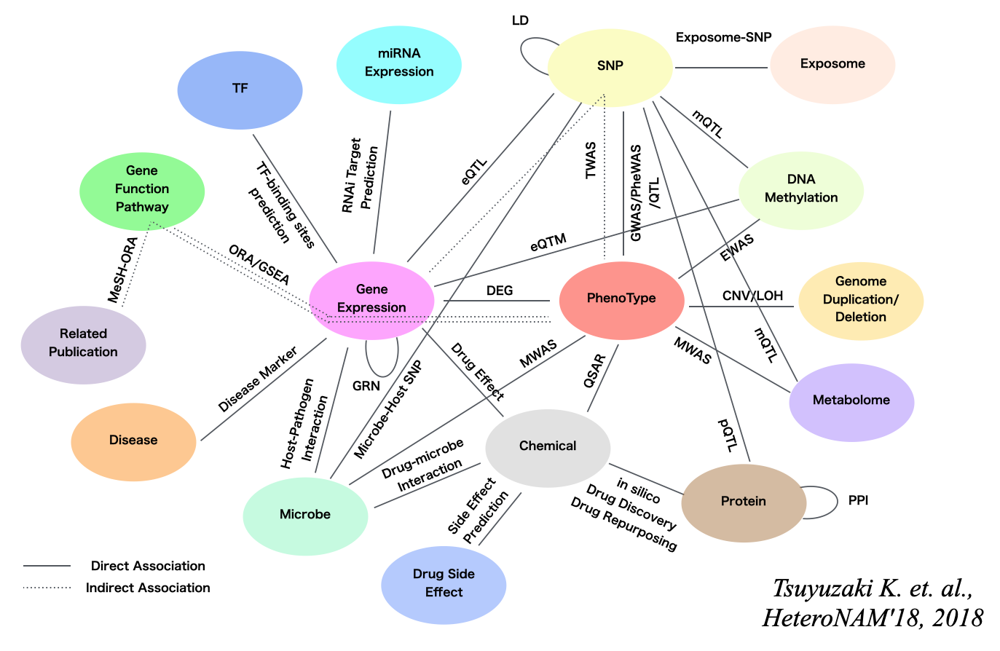
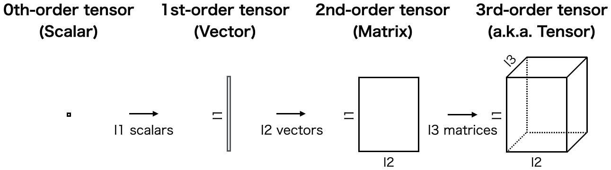
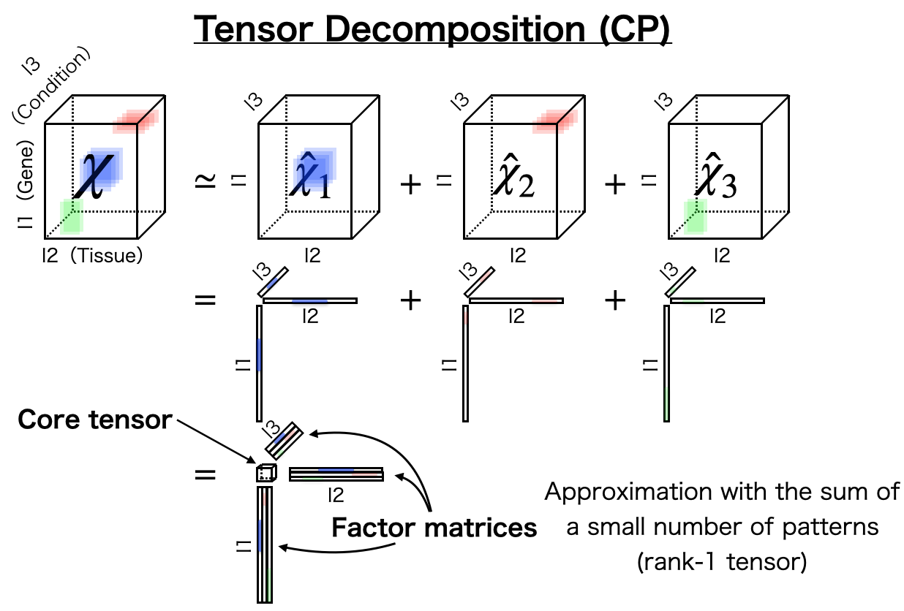
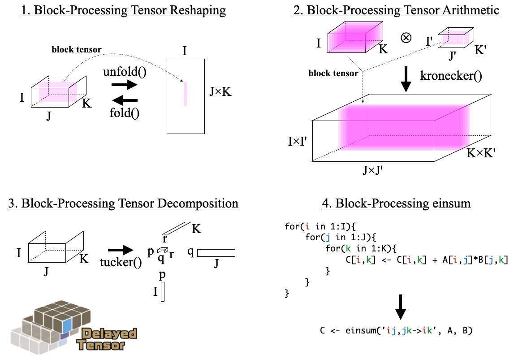

```{r style, echo = FALSE, results = 'asis', message=FALSE}
BiocStyle::markdown()
```

**Authors**: `r packageDescription("DelayedTensor")[["Author"]] `<br />
**Last modified:** `r file.info("DelayedTensor_1.Rmd")$mtime`<br />
**Compiled**: `r date()`

# Introduction
## Heterogenous Biological Data

Biological systems have very complicated structures like this
figure^[https://f1000research.com/slides/9-1260].



For example, in the cell, DNA sequences are folded in cellular nucleus,
RNA molecules are transcripted from the DNA,
proteins are translated from the RNAs,
and finally, the proteins are related to cellular functions.
Outside of the cell, there are also many signals like a bacterial infection,
adding chemical reagents, drugs, lifestyle, and so on.
The change of these molecular types/phenomena finally causes the phenotype
such as disease, BMI, and morphology.
It is not possible to measure all molecular types or phenomena simultaneously,
so one or two of them are chosen and exhaustively measured.
This approach is called omics study and widely used.
For example, genomics measure all DNA sequences, and transcriptomics measure
all RNA molecules.

There is a need for a framework that can handle and analyze such
heterogeneous data structures in a unified manner and
provide biological interpretation.
Tensors are a mathematical framework
that can be very useful in such a situation.

## What is Tensor

A tensor can be considered as a generalized form of data
representation^[https://f1000research.com/slides/9-1260].
For example, a scalar value, a vector, and a matrix are also called 0th-order
tensor, 1st-order tensor, and 2nd-order tensor, respectively.
If a data has three "modes" (1. height, 2. width, and 3. depth),
it is called a 3rd-order tensor.



That's why any data is basically a tensor,
but in most cases, the term tensor implies 3rd-order or higher-order tensor.

## What is Tensor Decomposition

Tensor decomposition is the extension of matrix decomposition.
If we have a third-order tensor,
gene times tissue times condition,
using tensor decomposition, we can extract a small number of
patterns^[https://f1000research.com/slides/9-1260].



Each vector can be summarized to the multiple matrices and
these are called factor matrices.
The scalar values are summarized to a small tensor,
and this is called core tensor.

## Concept of DelayedTensor: Block Processing-enabled Tensor Operations

A tensor is more than just a multi-dimensional array; as we will see later,
there are various operations that are specific to tensors, such as reshaping,
mode-wise statistics, and various tensor products.
These operations are essential in the analysis of tensor data and
the implementation of tensor decomposition algorithms.
Although the standard `array` of R language can express
increasing orders of tensors, it does not provide tensor-specific operations.
Therefore, many R users manipulate tensor data by using
the functions implemented in the `r CRANpkg("rTensor")` package for now.
Although `r CRANpkg("rTensor")` is very useful,
it assumes the input object to be an in-memory array.
On the other hand, tensors can easily become huge
as the order and the size of each mode increase,
and may no longer fit in memory.

`r Biocpkg("DelayedTensor")` is implmented for such extreamly huge tensor data.
`r Biocpkg("DelayedTensor")` provides some functions of `r CRANpkg("rTensor")`
by reimplementing them with `r Biocpkg("DelayedArray")`.
`r Biocpkg("DelayedArray")` is a framework that allows us to use the data
on the disk as if it were a standard array in R.
There are some out-of-core backend file system such as `r Biocpkg("HDF5Array")`
and `r Biocpkg("TileDBArray")` used in `r Biocpkg("DelayedArray")`
and the incremental calculations can be performed
by implementing the functions in support of "block processing".

The functionality of DelayedTensor is fourfold.


1. **Block-Processing Tensor Reshaping**: Operations such as folding
and unfolding a higher-order tensor data into a matrix
can be performed while taking care of the block size.

2. **Block-Processing Tensor Arithmetic**: Calculation of sums and averages
for each mode, and operations such as Hadamard product, Kronecker product,
and Khatri-Rao product can be performed while taking care of block size.

3. **Block-Processing Tensor Decomposition**: Some of the tensor decomposition
algorithms implemented in `r CRANpkg("rTensor")` have been reimplemented using
reshaping and arithmetic functions of `r Biocpkg("DelayedTensor")`.

4. **Block-Processing einsum**: In addition to the `r CRANpkg("rTensor")`
functions, the `r CRANpkg("einsum")` function, which is well-known as
the Numpy (Python) function, has also been reimplemented based on
`r Biocpkg("DelayedArray")` and the block processing framework.
`r CRANpkg("einsum")` is a very powerful preprocessing method
to merge multiple tensor data into a single tensor.

Although what is executed inside the functions are very different,
the function name, argument name, and value name are exactly the same
as those of `r CRANpkg("rTensor")`
so that `r CRANpkg("rTensor")` users can easily introduce them.

# Session information {.unnumbered}

```{r sessionInfo, echo=FALSE}
sessionInfo()
```