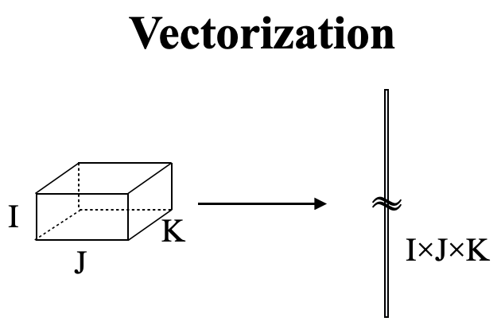
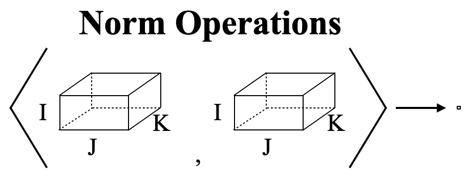
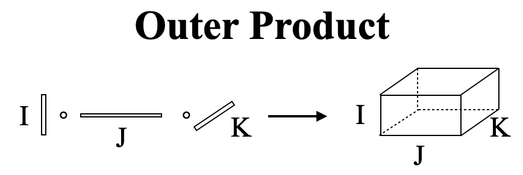
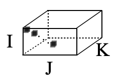
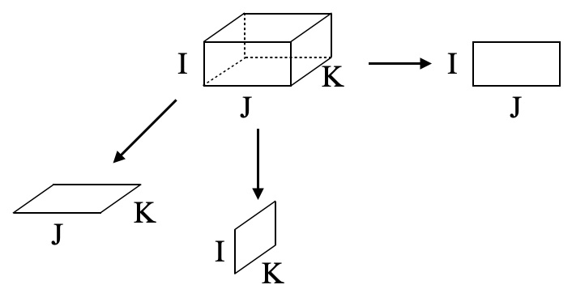
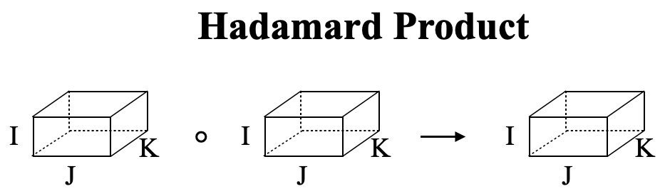
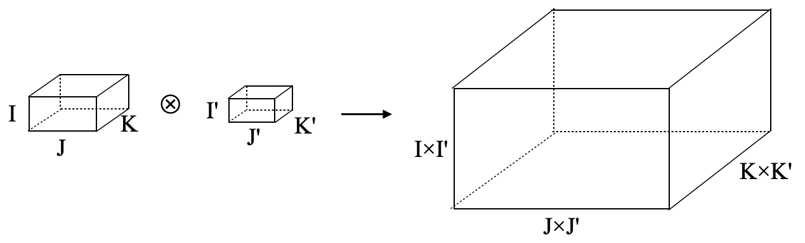
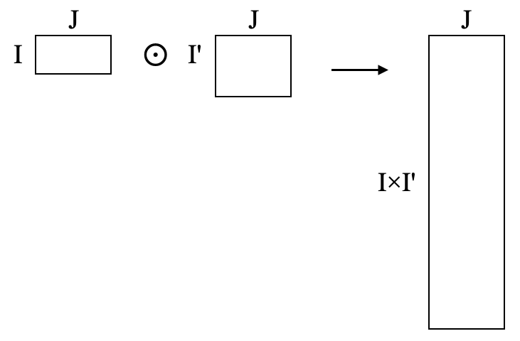
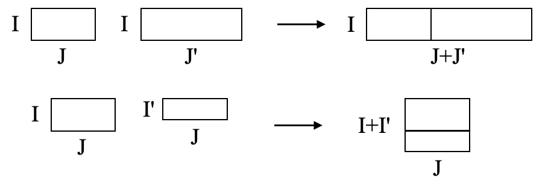

```{r style, echo = FALSE, results = 'asis', message=FALSE}
BiocStyle::markdown()
```

**Authors**: `r packageDescription("DelayedTensor")[["Author"]] `<br />
**Last modified:** `r file.info("DelayedTensor_2.Rmd")$mtime`<br />
**Compiled**: `r date()`

# Setting

```{r Setting 1, echo=TRUE}
suppressPackageStartupMessages(library("DelayedTensor"))
suppressPackageStartupMessages(library("DelayedArray"))
suppressPackageStartupMessages(library("DelayedRandomArray"))

darr1 <- RandomUnifArray(c(2,3,4))
darr2 <- RandomUnifArray(c(2,3,4))
```

There are several settings in `r Biocpkg("DelayedTensor")`.

First, the sparsity of the intermediate `r Biocpkg("DelayedArray")` objects
calculated inside `r Biocpkg("DelayedTensor")` is set by `setSparse`.

Note that the sparse mode is experimental.

Whether it contributes to higher speed and lower memory is quite dependent
on the sparsity of the `r Biocpkg("DelayedArray")`,
and the current implementation does not recognize the block size,
which may cause out-of-memory errors, when the data is extremely huge.

Here, we specify `as.sparse` as `FALSE`
(this is also the default value for now).

```{r Setting 2, echo=TRUE}
DelayedTensor::setSparse(as.sparse=FALSE)
```

Next, the verbose message is suppressed by `setVerbose`.
This is useful when we want to monitor the calculation process.

Here we specify `as.verbose` as `FALSE`
(this is also the default value for now).

```{r Setting 3, echo=TRUE}
DelayedTensor::setVerbose(as.verbose=FALSE)
```

Finally, the block size of block processing is specified by `setAutoBlockSize`.
When the sparse mode is off, all the functions of `r Biocpkg("DelayedTensor")`
are performed as block processing,
in which each block vector/matrix/tensor is expanded to memory space
from on-disk file incrementally so as not to exceed the specified size.

Here, we specify the block size as `1E+8`.

```{r Setting 4, echo=TRUE}
setAutoBlockSize(size=1E+8)
```

These specified values are also extracted by each getter function.

```{r Setting 5, echo=TRUE}
DelayedTensor::getSparse()
DelayedTensor::getVerbose()
getAutoBlockSize()
```

# Tensor Arithmetic Operations
## Unfold/Fold Operations

Unfold (a.k.a. matricizing) operations are used to reshape a tensor into a
matrix.


In `unfold`, `row_idx` and `col_idx` are specified to set which modes are used
as the row/column.

```{r Unfold/Fold operations 1, echo=TRUE}
dmat1 <- DelayedTensor::unfold(darr1, row_idx=c(1,2), col_idx=3)
dmat1
```

`fold` is the inverse operation of `unfold`, which is used to reshape
a matrix into a tensor.

In `fold`, `row_idx`/`col_idx` are specified to set which modes correspond
the row/column of the output tensor and `modes`
is specified to set the mode of the output tensor.

```{r Unfold/Fold operations 2, echo=TRUE}
dmat1_to_darr1 <- DelayedTensor::fold(dmat1,
    row_idx=c(1,2), col_idx=3, modes=dim(darr1))
dmat1_to_darr1
identical(as.array(darr1), as.array(dmat1_to_darr1))
```

There are some wrapper functions of `unfold` and `fold`.

For example, in `k_unfold`, mode `m` is used as the row, and the other modes
are is used as the column.

`k_fold` is the inverse operation of `k_unfold`.

```{r Unfold/Fold operations 3, echo=TRUE}
dmat2 <- DelayedTensor::k_unfold(darr1, m=1)
dmat2_to_darr1 <- k_fold(dmat2, m=1, modes=dim(darr1))
identical(as.array(darr1), as.array(dmat2_to_darr1))

dmat3 <- DelayedTensor::k_unfold(darr1, m=2)
dmat3_to_darr1 <- k_fold(dmat3, m=2, modes=dim(darr1))
identical(as.array(darr1), as.array(dmat3_to_darr1))

dmat4 <- DelayedTensor::k_unfold(darr1, m=3)
dmat4_to_darr1 <- k_fold(dmat4, m=3, modes=dim(darr1))
identical(as.array(darr1), as.array(dmat4_to_darr1))
```

In `rs_unfold`, mode `m` is used as the row, and the other modes
are is used as the column.

`rs_fold` and `rs_unfold` also perform the same operations.

On the other hand, `cs_unfold` specifies the mode `m` as the column
and the other modes are specified as the column.

`cs_fold` is the inverse operation of `cs_unfold`.

```{r Unfold/Fold operations 4, echo=TRUE}
dmat8 <- DelayedTensor::cs_unfold(darr1, m=1)
dmat8_to_darr1 <- DelayedTensor::cs_fold(dmat8, m=1, modes=dim(darr1))
identical(as.array(darr1), as.array(dmat8_to_darr1))

dmat9 <- DelayedTensor::cs_unfold(darr1, m=2)
dmat9_to_darr1 <- DelayedTensor::cs_fold(dmat9, m=2, modes=dim(darr1))
identical(as.array(darr1), as.array(dmat9_to_darr1))

dmat10 <- DelayedTensor::cs_unfold(darr1, m=3)
dmat10_to_darr1 <- DelayedTensor::cs_fold(dmat10, m=3, modes=dim(darr1))
identical(as.array(darr1), as.array(dmat10_to_darr1))
```

In `matvec`, m=2 is specified as unfold.

`unmatvec` is the inverse operation of `matvec`.

```{r Unfold/Fold operations 5, echo=TRUE}
dmat11 <- DelayedTensor::matvec(darr1)
dmat11_darr1 <- DelayedTensor::unmatvec(dmat11, modes=dim(darr1))
identical(as.array(darr1), as.array(dmat11_darr1))
```

`ttm` multiplies a tensor by a matrix.

`m` specifies in which mode the matrix will be multiplied.

```{r Unfold/Fold operations 7, echo=TRUE}
dmatZ <- RandomUnifArray(c(10,4))
DelayedTensor::ttm(darr1, dmatZ, m=3)
```

`ttl` multiplies a tensor by multiple matrices.

`ms` specifies in which mode these matrices will be multiplied.

```{r Unfold/Fold operations 6, echo=TRUE}
dmatX <- RandomUnifArray(c(10,2))
dmatY <- RandomUnifArray(c(10,3))
dlizt <- list(dmatX = dmatX, dmatY = dmatY)
DelayedTensor::ttl(darr1, dlizt, ms=c(1,2))
```

## Vectorization

`vec` collapses a `r Biocpkg("DelayedArray")` into
a 1D `r Biocpkg("DelayedArray")` (vector).



```{r Vectorization, echo=TRUE}
DelayedTensor::vec(darr1)
```

## Norm Operations

`fnorm` calculates the Frobenius norm of a `r Biocpkg("DelayedArray")`.



```{r Norm operations 1, echo=TRUE}
DelayedTensor::fnorm(darr1)
```

`innerProd` calculates the inner product value of two
`r Biocpkg("DelayedArray")`.

```{r Norm operations 2, echo=TRUE}
DelayedTensor::innerProd(darr1, darr2)
```

## Outer Product

Inner product multiplies two tensors and collapses to 0D tensor (norm).
On the other hand, the outer product is an operation that leaves all subscripts intact.



```{r Outer Product, echo=TRUE}
DelayedTensor::outerProd(darr1[,,1], darr2[,,1])
```

## Diagonal Operations

Using `DelayedDiagonalArray`, we can originally create a diagonal
`r Biocpkg("DelayedArray")` by specifying the dimensions (modes) and the values.



```{r Diagonal operations 1, echo=TRUE}
dgdarr <- DelayedTensor::DelayedDiagonalArray(c(5,6,7), 1:5)
dgdarr
```

Similar to the `diag` of the `r CRANpkg("base")` package,
the `diag` of `r Biocpkg("DelayedTensor")` is used to extract
and assign values to `r Biocpkg("DelayedArray")`.

```{r Diagonal operations 2, echo=TRUE}
DelayedTensor::diag(dgdarr)
```

```{r Diagonal operations 3, echo=TRUE}
DelayedTensor::diag(dgdarr) <- c(1111, 2222, 3333, 4444, 5555)
DelayedTensor::diag(dgdarr)
```

## Mode-wise Operations

`modeSum` calculates the summation for a given mode `m` of
a `r Biocpkg("DelayedArray")`.
The mode specified as `m` is collapsed into 1D as follows.



```{r Mode-wise operations 1, echo=TRUE}
DelayedTensor::modeSum(darr1, m=1)
DelayedTensor::modeSum(darr1, m=2)
DelayedTensor::modeSum(darr1, m=3)
```

Similar to `modeSum`, `modeMean` calculates the average value
for a given mode `m` of a `r Biocpkg("DelayedArray")`.

```{r Mode-wise operations 2, echo=TRUE}
DelayedTensor::modeMean(darr1, m=1)
DelayedTensor::modeMean(darr1, m=2)
DelayedTensor::modeMean(darr1, m=3)
```

## Tensor Product Operations

There are some tensor specific product such as Hadamard product,
Kronecker product, and Khatri-Rao product.

### Hadamard Product

Suppose a tensor $A \in \Re ^{I \times J}$ and
a tensor $B \in \Re ^{I \times J}$.

Hadamard product is defined as the element-wise product of $A$ and $B$.



Hadamard product can be extended to higher-order tensors.

$$
A \circ B = \begin{bmatrix}
a_{11}b_{11} & a_{12}b_{12} & \cdots & a_{1J}b_{1J} \\
a_{21}b_{21} & a_{22}b_{22} & \cdots & a_{2J}b_{2J} \\
\vdots & \vdots & \ddots & \vdots \\
a_{I1}b_{I1} & a_{I2}b_{I2} & \cdots & a_{IJ}b_{IJ} \\
\end{bmatrix}
$$

`hadamard` calculates Hadamard product of two `r Biocpkg("DelayedArray")`
objects.

```{r Tensor product operations 1, echo=TRUE}
prod_h <- DelayedTensor::hadamard(darr1, darr2)
dim(prod_h)
```

`hadamard_list` calculates Hadamard product of multiple
`r Biocpkg("DelayedArray")` objects.

```{r Tensor product operations 2, echo=TRUE}
prod_hl <- DelayedTensor::hadamard_list(list(darr1, darr2))
dim(prod_hl)
```

### Kronecker Product

Suppose a tensor $A \in \Re ^{I \times J}$ and
a tensor $B \in \Re ^{K \times L}$.

Kronecker product is defined as all the possible combination of element-wise
product and the dimensions of output tensor are ${IK \times JL}$.



Kronecker product can be extended to higher-order tensors.

$$
A \otimes B = \begin{bmatrix}
a_{11}B & a_{12}B & \cdots & a_{1J}B \\
a_{21}B & a_{22}B & \cdots & a_{2J}B \\
\vdots & \vdots & \ddots & \vdots \\
a_{I1}B & a_{I2}B & \cdots & a_{IJ}B \\
\end{bmatrix}
$$

`kronecker` calculates Kronecker product of two `r Biocpkg("DelayedArray")`
objects.

```{r Tensor product operations 3, echo=TRUE}
prod_kron <- DelayedTensor::kronecker(darr1, darr2)
dim(prod_kron)
```

`kronecker_list` calculates Kronecker product of multiple
`r Biocpkg("DelayedArray")` objects.

```{r Tensor product operations 4, echo=TRUE}
prod_kronl <- DelayedTensor::kronecker_list(list(darr1, darr2))
dim(prod_kronl)
```

### Khatri-Rao Product

Suppose a tensor $A \in \Re ^{I \times J}$ and
a tensor $B \in \Re ^{K \times J}$.

Khatri-Rao product is defined as the column-wise Kronecker product
and the dimensions of output tensor is ${IK \times J}$.

$$
A \odot B = \begin{bmatrix}
a_{1} \otimes a_{1} & a_{2} \otimes a_{2} & \cdots & a_{J} \otimes a_{J} \\
\end{bmatrix}
$$



Khatri-Rao product can only be used for 2D tensors (matrices).

`khatri_rao` calculates Khatri-Rao product of two `r Biocpkg("DelayedArray")`
objects.

```{r Tensor product operations 5, echo=TRUE}
prod_kr <- DelayedTensor::khatri_rao(darr1[,,1], darr2[,,1])
dim(prod_kr)
```

`khatri_rao_list` calculates Khatri-Rao product of multiple
`r Biocpkg("DelayedArray")` objects.

```{r Tensor product operations 6, echo=TRUE}
prod_krl <- DelayedTensor::khatri_rao_list(list(darr1[,,1], darr2[,,1]))
dim(prod_krl)
```

## Utilities Functions

`list_rep` replicates an arbitrary number of any R object.

```{r Utilities 1, echo=TRUE}
str(DelayedTensor::list_rep(darr1, 3))
```

### Bind Operations

`modebind_list` collapses multiple `r Biocpkg("DelayedArray")` objects
into single `r Biocpkg("DelayedArray")` object.

`m` specifies the collapsed dimension.



```{r Utilities 2, echo=TRUE}
dim(DelayedTensor::modebind_list(list(darr1, darr2), m=1))
dim(DelayedTensor::modebind_list(list(darr1, darr2), m=2))
dim(DelayedTensor::modebind_list(list(darr1, darr2), m=3))
```

`rbind_list` is the row-wise `modebind_list` and
collapses multiple 2D `r Biocpkg("DelayedArray")` objects
into single `r Biocpkg("DelayedArray")` object.

```{r Utilities 3, echo=TRUE}
dim(DelayedTensor::rbind_list(list(darr1[,,1], darr2[,,1])))
```

`cbind_list` is the column-wise `modebind_list` and
collapses multiple 2D `r Biocpkg("DelayedArray")` objects
into single `r Biocpkg("DelayedArray")` object.

```{r Utilities 4, echo=TRUE}
dim(DelayedTensor::cbind_list(list(darr1[,,1], darr2[,,1])))
```

# Session information {.unnumbered}

```{r sessionInfo, echo=FALSE}
sessionInfo()
```